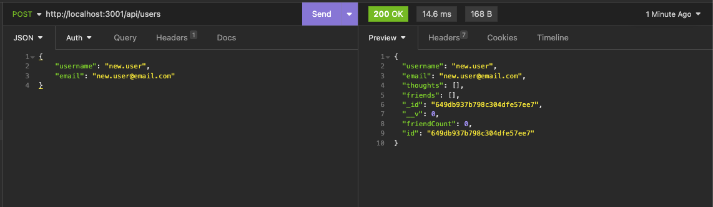
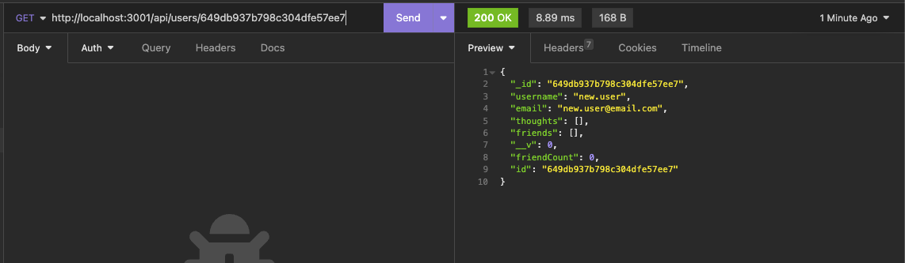
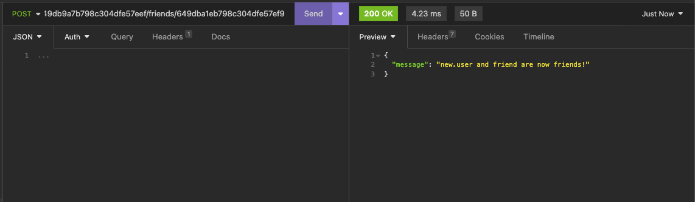
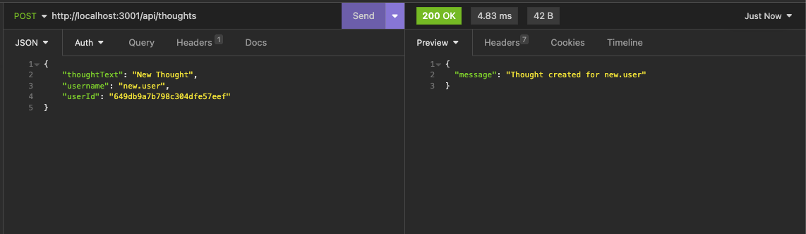
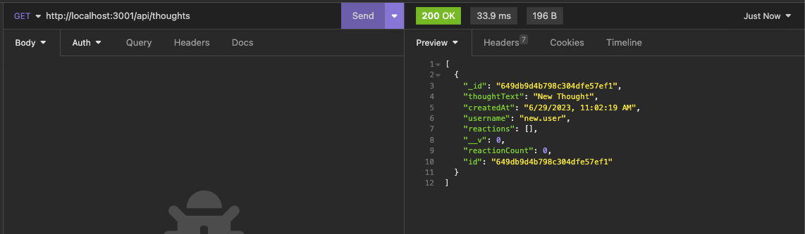
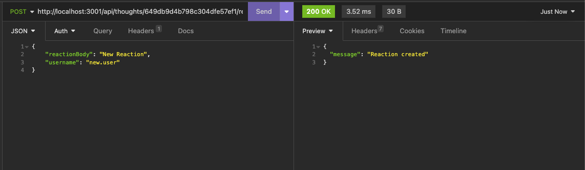

# Challenge 18 - Social Network API

## Project Description

Your new social network project should be supported on the backend by a reliable solution using the latest technologies as this will help you scale in the future. This API provides you with the endpoints to get you started.

This API is powered by MongoDB and the `mongoose` library allows us to connect to a MongoDB database and create models to support the different functionality required.

NoSQL is a new concept to me but having used relational databases extensively in the past made it easy to grasp and implement the solution.

## Table of Contents
- [User Story](#user-story)
- [Acceptance Criteria](#acceptance-criteria)
- [Links](#links)
- [Dependencies](#dependencies)
- [Usage](#usage)
- [Walkthrough](#walkthrough)
- [Screenshots](#screenshots)

## User Story

```md
AS A social media startup
I WANT an API for my social network that uses a NoSQL database
SO THAT my website can handle large amounts of unstructured data
```

## Acceptance Criteria

```md
GIVEN a social network API
WHEN I enter the command to invoke the application
THEN my server is started and the Mongoose models are synced to the MongoDB database
WHEN I open API GET routes in Insomnia for users and thoughts
THEN the data for each of these routes is displayed in a formatted JSON
WHEN I test API POST, PUT, and DELETE routes in Insomnia
THEN I am able to successfully create, update, and delete users and thoughts in my database
WHEN I test API POST and DELETE routes in Insomnia
THEN I am able to successfully create and delete reactions to thoughts and add and remove friends to a user’s friend list
```
 
## Links

To access the code repository, use the link below:

- ### GitHub Repository URL
    https://github.com/sergiorodriguezdev/chl-18-social-network-api 

## Dependencies

To install the appropriate dependencies, execute the following command from the repo folder:

```
npm install
```

Alternatively, if the `package.json` file is missing, execute the following commands from the repo folder:

```
npm init -y
npm install mongoose@7.3.1
npm install express@4.18.2
```

## Usage

1. ### Installing the Dependencies
    Clone or download the repo directory to your local machine and install the dependencies as specified in the [Dependencies](#dependencies) section.

2. ### Updating NoSQL database connection information
    Open the `./config/connection.js` file and update the `connectionString` value if necessary.

3. ### Seeding the database (OPTIONAL)
    To seed the database, you must run the following command from the repo directory:
    ```
    npm run seed
    ```
    Or
    ```
    node seeds/index.js
    ```

4. ### Using the app
    Launch the app by executing the following command:
    ```
    npm start
    ```
    Or
    ```
    node server.js
    ```
    
    The following API endpoints are available:

    **USERS**
    
    + *GET /api/users*

        Returns a list of all User documents.
    
    + *GET /api/users/{id}*
    
        Returns a single User document including its `friends` and `thoughts` subdocuments populated where `{id}` is the User ID.

    + *POST /api/users*

        Creates a new User. The Body of the request should look like this:

        ```
        {
	        "username": "new.user",
            "email": "new.user@email.com"
        }
        ```
        Required fields: `username` and `email`.

    + *PUT /api/users/{id}*

        Updates an existing User where `{id}` is the User ID. The Body of the request should look like this:

        ```
        {
	        "email": "updated.user@email.com"
        }
        ```
        Required fields: `email`.

    + *DELETE /api/users/{id}*

        Deletes an existing User and its corresponding Thought documents where `{id}` is the User ID.

    **FRIENDS**

    + *POST /api/users/{userId}/friends/{friendId}*

        Creates an entry in the `friends` subdocument of two different Users where `{userId}` and `{friendId}` are User IDs.

        `{friendId}` is added to the `friends` subdocument of the User whose `_id` property equals `{userId}`, and vice versa.

    + *DELETE /api/users/{userId}/friends/{friendId}*

        Deletes the corresponding entries from the `friends` subdocument of two different Users where `{userId}` and `{friendId}` are User IDs.
        
        `{friendId}` is removed from the `friends` subdocument of the User whose `_id` property equals `{userId}`, and vice versa.

    **THOUGHTS**
    
    + *GET /api/thoughts*

        Returns a list of all Thought documents and its corresponding Reactions subdocuments.
    
    + *GET /api/thoughts/{id}*
    
        Returns a single Thought document where `{id}` is the Thought ID.

    + *POST /api/thoughts*

        Creates a new Thought. The Body of the request should look like this:

        ```
        {
            "thoughtText": "New Thought",
            "username": "existing.user",
            "userId": "{userId}"
        }
        ```
        Required fields: `thoughtText`, `username`, and `userId` which is the User ID that corresponds to the `username` specified.

    + *PUT /api/thoughts/{id}*

        Updates an existing Thought where `{id}` is the Thought ID. The Body of the request should look like this:

        ```
        {
            "thoughtText": "Updated Thought"
        }
        ```
        Required fields: `thoughtText`.

    + *DELETE /api/thoughts/{id}*

        Deletes an existing Thought where `{id}` is the Product ID. The corresponding entry is also removed from the related User document's `thoughts` subdocument.

    **REACTIONS**

    + *POST /api/thoughts/{id}/reactions*

        Creates a new Reaction in the corresponding Thought's `reactions` subdocument where `{id}` is the Thought ID. The Body of the request should look like this:

        ```
        {
	        "reactionBody": "New Reaction",
            "username": "existing.user"
        }
        ```
        Required fields: `reactionBody` and `username`.

    + *DELETE /api/thoughts/{thoughtId}/reactions/{reactionId}*

        Deletes the corresponding entry from the `reactions` subdocument of an existing Thought where `{thoughtId}` is the Thought ID and `{reactionId}` is the ID of the Reaction to be deleted.

## Walkthrough

Click [HERE](https://github.com/sergiorodriguezdev/chl-18-social-network-api/assets/119548442/87407332-8adc-4c5c-8799-80193f81ab4a) for a walkthrough of the app.

## Screenshots











